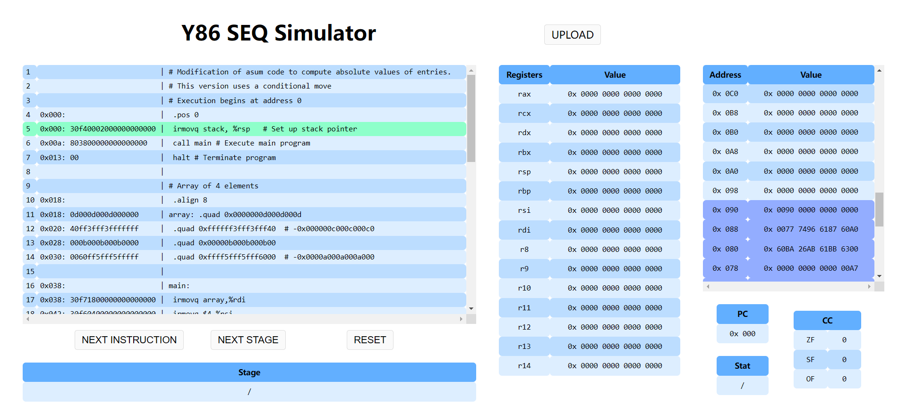

## 前端实现方法

### 1. 基本介绍

我们使用Python的FLASK框架，加上三件套HTML+CSS+JavaScript完成了前端Web页面的构建。
其中，HTML文件在`./templates`文件夹中，CSS和JS文件在`./static`文件夹中。
要运行该项目，查看网页，需要**提前安装FLASK库**。之后在项目目录下设置环境变量并运行
```
$ export FLASK_APP=setup   // 使用不同终端的方法不同，具体见 https://dormousehole.readthedocs.io/en/latest/quickstart.html#id2
$ python setup.py
```
之后，在浏览器中访问链接`http://127.0.0.1:5000`，即可进入前端页面。

### 2. 页面介绍


点击`UPLOAD`按钮，上传需要模拟运行的文件。


运行分为两种模式：
- 点击`NEXT INSTRUCTION`按钮，执行一条指令。
- 点击`NEXT STAGE`按钮，执行一个阶段（共6个阶段：`FETCH`, `DECODE`, `EXECUTE`, `MEMORY`, `WRITE BACK`, `PC UPDATE`）。

运行过程中，左边代码框中会高亮下一条要执行的指令，其余框中会呈现本条指令执行完后各部分的值。此外，中间寄存器框中会高亮本条指令或本阶段执行中所涉及的寄存器；右边内存框的底部高亮了写入了指令代码的内存。


### 3. 具体实现

#### 前后端分离

本项目使用AJAX和FLASK完成前后端的数据传递。

首先，在`setup.py`中利用FLASK框架，创建了名为`setup`的应用，并搭建了本地服务器。地址为`http://localhost:5000/`。此时，在本机的5000端口就启动了服务器，可以在本地查看网页。

##### 前端向后端传文件

使用AJAX。点击`UPLOAD`，上传好文件后，发生了`onchange`事件，调用`upload()`函数。`upload()`函数利用JavaScript中的AJAX，以`post`的方式，将文件传到`URL`为`/upload/`的地方。`setup.py`中接收了这个传文件的信号，将传来的文件保存在服务器（也就是主机）当前文件夹的`./upload/`文件夹中。这就完成了前端向后端的文件传递。

##### 后端向前端传数据

接着后端打开对应文件，进行处理，得到`json`形式数据，可以携带数据返回响应到前端。前端接收到这个响应，也就接收了对应`json`数据，可以利用JavaScript，对数据进行处理，使得HTML表单内容发生相应改变。

类似地，点击`NEXT INSTRUCTION`, `NEXT STAGE`, `RESET`按钮后，前端传给后端json格式的数据，记为`{'signal': signal}`，根据按钮的不同，传的`signal`字符串的内容不同。后端可以对该数据进行处理，同样返回携带json数据的响应到前端。


#### 前端JavaScript处理

前端利用后端传入的数据，执行对应JavaScript脚本。

`content(input, flag)`和`init()`函数
将传入的json数据，通过`id`选择对应的元素，写入HTML，即可完成内容的更改。
`content`函数根据对应`flag`，编写并返回对应的元素的HTML字符串。

`highlight(res)`函数
用于执行过程中高亮实现。
`next_code`, `next_register`和`next_mem`返回需要高亮的行数`line`(类型可以为数字`number`或对象(数组)`object`)。三者分别返回
- `next_code`: 下一步指令的行
- `next_register`: 本步涉及的寄存器的行
- `next_mem`: 内存区代码段的行

`sub_highlight(tbl, line)`则设置对应的`tbl`元素中第`line`行的背景。


#### 前端其余处理

通过几个`div`将页面划分成几个部分，分别设置对应大小、颜色等样式。利用CSS伪类，选择表格的奇偶行，分别设置背景。