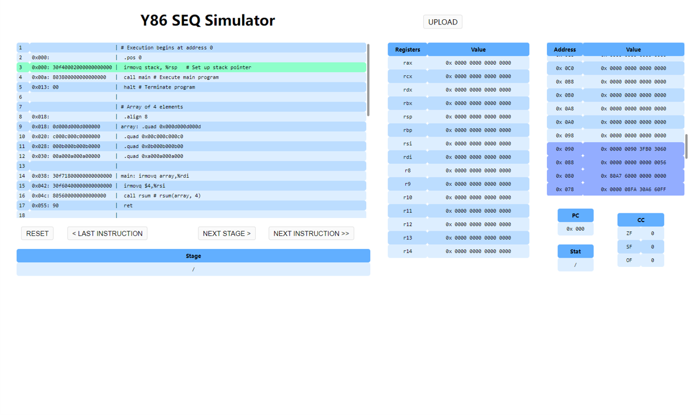
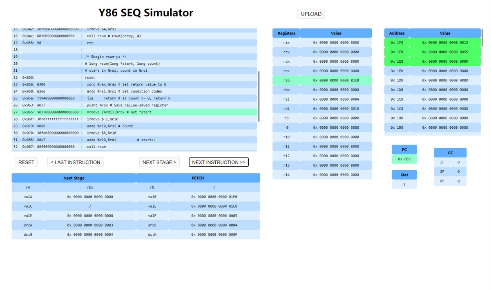

## 前端实现方法

### 1. 基本介绍

我们使用Python的FLASK框架，加上三件套HTML+CSS+JavaScript完成了前端Web页面的构建。
其中，HTML文件在`./templates`文件夹中，CSS和JS文件在`./static`文件夹中。
要运行该项目，查看网页，需要**提前安装FLASK库**。之后在项目目录下设置环境变量并运行
```
$ export FLASK_APP=setup   // 使用不同终端的方法不同，具体见 https://dormousehole.readthedocs.io/en/latest/quickstart.html#id2
$ python setup.py
```
之后，在浏览器中访问链接`http://127.0.0.1:5000`，即可进入前端页面。

### 2. 页面介绍


点击`UPLOAD`按钮，上传需要模拟运行的文件。


运行分为两种模式：
- 点击`NEXT INSTRUCTION`按钮，执行一条指令。
- 点击`NEXT STAGE`按钮，执行一个阶段（共6个阶段：`FETCH`, `DECODE`, `EXECUTE`, `MEMORY`, `WRITE BACK`, `PC UPDATE`）。


运行过程中，左边代码框中会高亮即将要执行或执行中的指令，其余框中会呈现某一阶段或一条指令执行完后各部分的值。此外，其余框内会高亮发生变化的部分。在内存框中，额外高亮了栈帧内存和代码内存。
注意，内存框中的地址是8字节最低位的地址。


### 3. 具体实现

#### 前后端分离

本项目使用AJAX和FLASK完成前后端的数据传递。

首先，在`setup.py`中利用FLASK框架，创建了名为`setup`的应用，并搭建了本地服务器。地址为`http://localhost:5000/`。此时，在本机的5000端口就启动了服务器，可以在本地查看网页。

##### 前端向后端传文件

使用AJAX。点击`UPLOAD`，上传好文件后，发生了`onchange`事件，调用`upload()`函数。`upload()`函数利用JavaScript中的AJAX，以`post`的方式，将文件传到`URL`为`/upload/`的地方。`setup.py`中接收了这个传文件的信号，将传来的文件保存在服务器（也就是主机）当前文件夹的`./upload/`文件夹中。这就完成了前端向后端的文件传递。

##### 后端向前端传数据

接着`setup.py`调用`simulator`包中的函数，可以发送指令，使后端实时运行CPU，实现
- 执行 1 stage
- 执行 1 cycle
- 回退至本 cycle 的初始状态

的功能。后端接口函数返回的`json`格式的CPU状态等数据，可以发送到前端进行展示。前端接收到这个响应，也就接收了对应`json`数据，可以利用JavaScript，对数据进行处理，使得HTML表单内容发生相应改变。

类似地，点击`NEXT INSTRUCTION`, `NEXT STAGE`, `RESET`按钮后，前端传给后端json格式的数据，记为`{'signal': signal}`，根据按钮的不同，传的`signal`字符串的内容不同。后端可以对该数据进行处理，同样返回携带json数据的响应到前端。


#### 前端数据处理

前端利用后端传入的数据，执行对应JavaScript脚本。

`content()`和`init()`函数
将传入的json数据，通过`id`选择对应的元素，写入HTML，即可完成内容的更改。
`content()`函数根据对应`flag`，直接编写对应的元素的HTML字符串，在利用jQuery选中该元素，修改其HTML内容。

#### 前端高亮实现

代码块的高亮
利用`code_highlight()`函数实现。
首先调用`next_code()`函数，对比实际`PC`和代码中的`PC`得到即将执行语句的行标，再利用jQuery的选择器，选择特定行，更改背景。

其余部分的改变的部分高亮
先存储之前的返回`last_res`，再将`last_res`和`res`中的内容进行比较：发生变化的，在`content()`函数中更改HTML，标记其为`class="changed"`类；未发生变化的，标记其为`class="unchanged"`类。再利用jQuery分别设定每类的背景颜色。

`Memory`部分高亮
在`content()`函数中，直接更改每一行的HTML，设置其`id`为`id=mem_XX`。其中`XX`是对应行的10进制地址值。
代码段高亮：传入的数据中包含`rsp`可以达到的最小值`rsp_min`，这也就是代码段的最大值。再利用`id`遍历内存，将小于`rsp_min`的标记为`class="code_mem"`类。再设置背景颜色。
栈帧段高亮：`rsp`初始值为`rsp_init`，若未设定，则`rsp_init = 0`。当当前的`rsp`小于`rsp_init`时，则认为该值为栈底。再利用`id`遍历内存，将介于这两者之间的标记为`class="frame_mem"`类。再设置背景颜色。