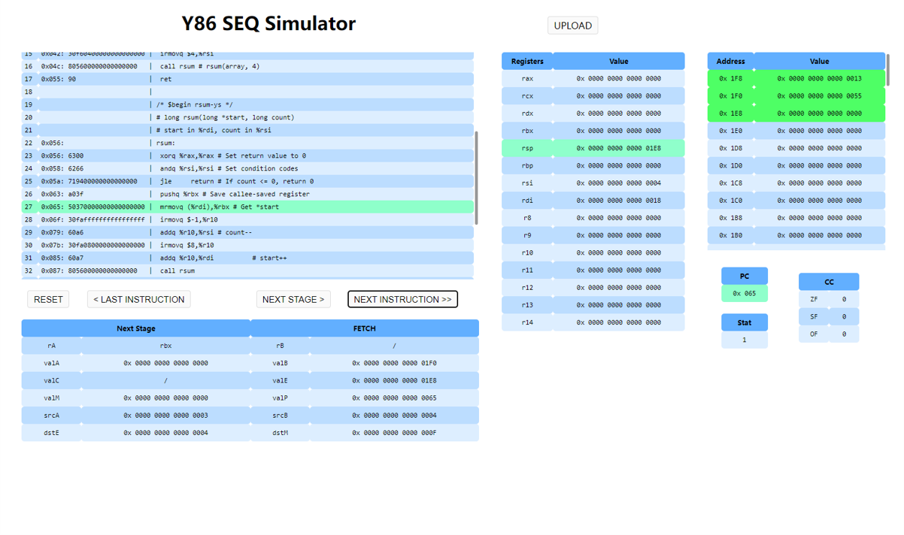

# Y86 Simulator Report
----
**作者**: 冯睿骐，励兵斌^[1]
2022 年 12 月


## 前端实现

### 1. 基本介绍

我们使用Python的FLASK框架，加上三件套HTML+CSS+JavaScript完成了前端Web页面的构建。
其中，HTML文件在`./templates`文件夹中，CSS和JS文件在`./static`文件夹中。
要运行该项目，查看网页，需要**提前安装FLASK库**。之后在项目目录下设置环境变量并运行
```
$ export FLASK_APP=setup   // 使用不同终端的方法不同，具体见 https://dormousehole.readthedocs.io/en/latest/quickstart.html#id2
$ python setup.py
```
之后，在浏览器中访问链接`http://127.0.0.1:5000`，即可进入前端页面。

### 2. 页面介绍


点击`UPLOAD`按钮，上传需要模拟运行的文件。


运行分为两种模式：
- 点击`NEXT INSTRUCTION`按钮，执行一条指令。
- 点击`NEXT STAGE`按钮，执行一个阶段（共6个阶段：`FETCH`, `DECODE`, `EXECUTE`, `MEMORY`, `WRITE BACK`, `PC UPDATE`）。


运行过程中，左边代码框中会高亮即将要执行或执行中的指令，其余框中会呈现某一阶段或一条指令执行完后各部分的值。此外，其余框内会高亮发生变化的部分。在内存框中，额外高亮了栈帧内存和代码内存。
注意，内存框中的地址是8字节最低位的地址。


### 3. 具体实现

#### 前后端分离

本项目使用AJAX和FLASK完成前后端的数据传递。

首先，在`setup.py`中利用FLASK框架，创建了名为`setup`的应用，并搭建了本地服务器。地址为`http://localhost:5000/`。此时，在本机的5000端口就启动了服务器，可以在本地查看网页。

##### 前端向后端传文件

使用AJAX。点击`UPLOAD`，上传好文件后，发生了`onchange`事件，调用`upload()`函数。`upload()`函数利用JavaScript中的AJAX，以`post`的方式，将文件传到`URL`为`/upload/`的地方。`setup.py`中接收了这个传文件的信号，将传来的文件保存在服务器（也就是主机）当前文件夹的`./upload/`文件夹中。这就完成了前端向后端的文件传递。

##### 后端向前端传数据

接着`setup.py`调用`simulator`包中的函数，可以发送指令，使后端实时运行CPU，实现
- 执行 1 stage
- 执行 1 cycle
- 回退至本 cycle 的初始状态

的功能。后端接口函数返回的`json`格式的CPU状态等数据，可以发送到前端进行展示。前端接收到这个响应，也就接收了对应`json`数据，可以利用JavaScript，对数据进行处理，使得HTML表单内容发生相应改变。

类似地，点击`NEXT INSTRUCTION`, `NEXT STAGE`, `RESET`按钮后，前端传给后端json格式的数据，记为`{'signal': signal}`，根据按钮的不同，传的`signal`字符串的内容不同。后端可以对该数据进行处理，同样返回携带json数据的响应到前端。


#### 前端数据处理

前端利用后端传入的数据，执行对应JavaScript脚本。

`content()`和`init()`函数
将传入的json数据，通过`id`选择对应的元素，写入HTML，即可完成内容的更改。
`content()`函数根据对应`flag`，直接编写对应的元素的HTML字符串，在利用jQuery选中该元素，修改其HTML内容。

#### 前端高亮实现

##### 代码块的高亮
利用`code_highlight()`函数实现。
首先调用`next_code()`函数，对比实际`PC`和代码中的`PC`得到即将执行语句的行标，再利用jQuery的选择器，选择特定行，更改背景。

##### 其余部分的改变的部分高亮
先存储之前的返回`last_res`，再将`last_res`和`res`中的内容进行比较：发生变化的，在`content()`函数中更改HTML，标记其为`class="changed"`类；未发生变化的，标记其为`class="unchanged"`类。再利用jQuery分别设定每类的背景颜色。

##### `Memory`部分高亮
在`content()`函数中，直接更改每一行的HTML，设置其`id`为`id=mem_XX`。其中`XX`是对应行的10进制地址值。
代码段高亮：传入的数据中包含`rsp`可以达到的最小值`rsp_min`，这也就是代码段的最大值。再利用`id`遍历内存，将小于`rsp_min`的标记为`class="code_mem"`类。再设置背景颜色。
栈帧段高亮：`rsp`初始值为`rsp_init`，若未设定，则`rsp_init = 0`。当当前的`rsp`小于`rsp_init`时，则认为该值为栈底。再利用`id`遍历内存，将介于这两者之间的标记为`class="frame_mem"`类。再设置背景颜色。


## 后端实现

#### 1. Sequential Y86 处理器的实现
- 因为数据是根据二补码表示的，涉及到位级操作时较为复杂，所以我们定义数据抽象类`DataArb`和子类`Word`, `Byte`实现相关操作，储存在`abstraction`子包中
  - `DataArb`是任意长度的二进制数据，用各个元素为`0`或`1`的python list实现。
    - 初始化：可以使用16进制`str`*或*10进制`int`
    - 方法：可以以16进制`str`*或*10进制`int`*或*2进制list of `int`输出；也可以指定ArbData中的某几个`Byte`，返回list of `Byte`s.
    - 主要在Instruction Memory中使用
    - 由于没有固定的长度，不能以有符号数解释，也不可以由有符号数字初始化
  - `Word`是64位的二进制数据，继承自`DataArb`
    - 由于有固定的长度，可以解释成有符号数字，可以由有符号数字初始化
  - `Byte`是8位的二进制数据，继承自`DataArb`
    - 主要在内存中使用

- 我们将寄存器，时钟，内存、ALU和指令内存的读、写等操作在相应的类中实现。我们将其封装成hardware子包，对应源文件在hardware目录下。
  - `Register` 类实现了寄存器的数据存储以及读写端口
    - 用一个长度为15的元素为`Word`的列表
  - `Memory` 类实现了内存的数据储存和读写接口
    - 内存是由`Byte`的列表实现的。由于内存使用小端法储存，这样的实现更符合直觉一些。
    - 写入方法中，只需要将`Word`转换成`Byte`s的列表并逆序储存即可，保持了数据抽象；读取也是类似的
  - `InstructMem` 类
    - 实现了指令读取、非法指令的判断
  - `Stat` 类
  - `CondCode` 类
  - `ALU` 类
    - 实现算术和逻辑运算，将输入的`Word`实例转换成int进行计算或者利用二进制list逐元素逻辑运算
- 在`CPU.py`中，我们实现了`CPU`类，在SEQ各阶段中实现各个上述组件之间的通信。
  - 由于实现中的一些判断较冗长，我们将整理到`sequence`包的各个模块中。
  - 控制`CPU`实例运行的接口为`run` 方法，它将调用一个生成器成员函数`cycle`，通过生成器的`send`方法控制CPU运行一个stage或者一个cycle。
- `simulator.py`中实现外部接口
  - `init_CPU`，传入汇编代码字符串，返回初始化完成的`CPU`实例
  - 通过正则表达式将字符串转换为数据，从而初始化内存
  - `run_CPU`，传入参数指定执行1 stage还是1 cycle，返回这步完成后的状态json，和其他信息，如异常消息、`valA`等中间值 

#### 2. 异常处理
- 根据异常状态码，我们使用3个Error类进行异常处理
  - `Halt`
  - `InstructionError`
  - `AddressError`
- 错误发生时，程序将抛出异常，并被CPU类的run方法中的异常处理语句接收。由于状态回退至异常发生的*一步*[^stage]之前，处理器的状态一定是即将发生错误的状态。更具体地说，我们的处理器
  - 不会允许*写入*错误的地址/*读取*错误的指令，在进行非法操作的尝试后停止运行
  - 读取Halt指令*后*停止运行
  
#### 3. 运行和测试用例
- 请在项目的根目录下运行 `python test.py --bin "python backend/simulator.py"`来进行测试。所有测试需要大约5秒。
- 我们的程序和`prog10.yo`的参考答案结果不同，最后一步中，我们的程序`rsp`为`0`，而参考答案为`-8`。如前所述，当出现地址错误时，我们的程序不会允许写入内存，而直接停止。由于Y86的约定是，先压栈再修改`rsp`，所以我们的程序停止时，`rsp`为`0`而非`-8`。这和测试用例所给答案不同，但我们认为我们的做法更合理些。

## 文件目录
```
backend
 ┣ abstraction
 ┃ ┣ data.py
 ┃ ┗ __init__.py
 ┣ hardware
 ┃ ┣ ALU.py
 ┃ ┣ Clock.py
 ┃ ┣ InstructMem.py
 ┃ ┣ Memory.py
 ┃ ┣ Registers.py
 ┃ ┗ __init__.py
 ┣ mytests
 ┃ ┣ test_cpu.py
 ┃ ┣ test_data.py
 ┃ ┣ test_error.py
 ┃ ┣ test_mem.py
 ┃ ┣ test_regs.py
 ┃ ┗ misc_test.py
 ┣ sequence
 ┃ ┣ decode.py
 ┃ ┣ execute.py
 ┃ ┣ fetch.py
 ┃ ┣ memory.py
 ┃ ┣ update_PC.py
 ┃ ┣ write_back.py
 ┃ ┗ __init__.py
 ┣ CPU.py
 ┣ error.py
 ┣ simulator.py
 ┣ simulator_local_test.py
 ┗ __init__.py
```

# 收获和感悟
### Git
第一次感受到`git`的精彩--我当然不会自称git大师，但是在较大的项目中使用恰当使用工作分支、发布分支和远程仓库，使得不管是本地开发、测试还是远程合作的效率都得到了较大的提高 

### 复用
在软件开发中过度追求"复用"有时可能并非最佳实践--这似乎在某种程度上增加了各个组件的耦合。但对芯片工程师来说，问题的答案就简单不少了，也许这是因为他们的产品并不需要时刻准备着修改？但我想，也不能说在器件数量和功能之间走钢丝不是一门艺术吧。

我们先实现了除了iaddq以外的所有指令，在测试时发现还有额外的这条指令。事实上，添加它几乎没有增加几行代码。只需要到各个SEQ阶段的选择判断函数中把`iaddq`对应的icode加到合适的条件里，就完成了。容易想象，在实际芯片设计中，新增这条指令大概利用了不少已有器件，从而增加了芯片的效率。但对于软件工程师来说，四处寻找散落的if else好像并不是什么美差。

### 前端开发
这次是第一次接触前端。在菜鸟教程的引领下，两天速成HTML+CSS+JS基础语法。其中前后端交互这一块耗费了大量的时间：尝试各的方法和框架，查找各种有所差异的资料，最后好不容易才写出来。其他的就感觉HTML语法非常麻烦，最后一段时间才利用jQuery较为简单地实现高亮等。

[^1]: 励兵斌主要负责前端开发，冯睿骐主要负责后端开发。
[^stage]: stage, 比如fetch stage, decode stage, etc. 请参见`hardware/CPU`中的`CPU.cycle`方法
